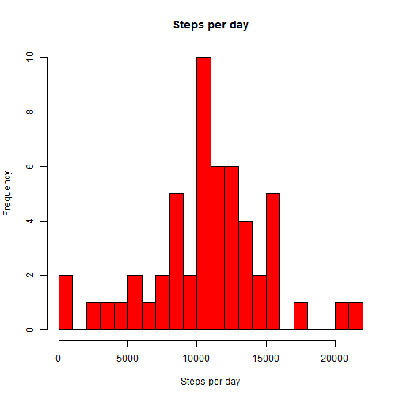
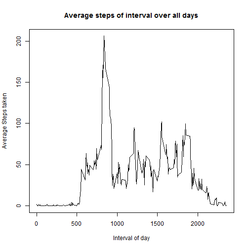
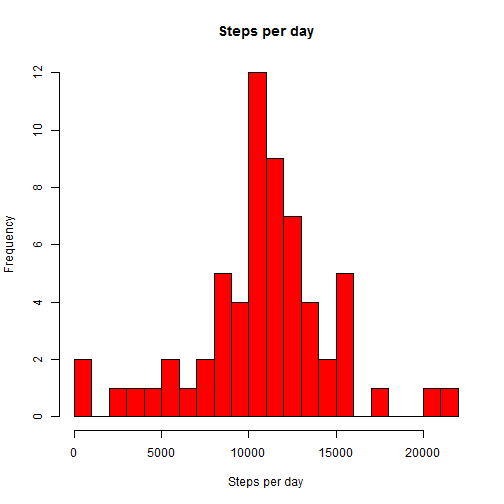
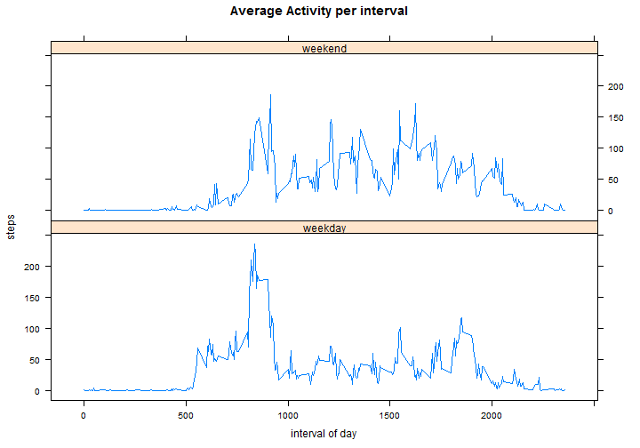

Programming Assignment 1, Reproducible Research
========================================================

Hey peer, thanks for taking the time to grade my Assignement

Note: I will go thru the same structure that was given by the Sections of the Instructions.

Loading and preprocessing the data
==================================


```r
data <- read.table(file="./activity.csv",header=T,sep=",", colClasses=c(time="numeric", "Date", "numeric"), na.strings = "NA")
#global value for hist breaks
histBreaks <- 1000
#set locale in order to make weekends function reproducible
Sys.setlocale("LC_TIME", "English")
```

```
## [1] "English_United States.1252"
```

What is mean total number of steps taken per day?
=================================================

* Make a histogram of the total number of steps taken each day
    
    ```r
    #build a by day sum aggregate of steps, only use none na values
    dailyAggregate <- aggregate(steps ~ date, data[!is.na(data$steps), ], FUN=sum) 
    ```

    
    ```r
    hist(dailyAggregate$steps,
         breaks=seq(0,max(dailyAggregate$steps)+histBreaks, histBreaks),
         freq=TRUE, 
         col="red",
         main="Steps per day",
         xlab="Steps per day",
         ylab="Frequency"
    	)
    ```
    
     

* Calculate and report the mean and median total number of steps taken per day
    
    ```r
    meanOriginal   <- mean(dailyAggregate$steps)
    sprintf("Mean of unprocessed Data:   %f", meanOriginal)
    ```
    
    ```
    ## [1] "Mean of unprocessed Data:   10766.188679"
    ```
    
    ```r
    medianOriginal <- median(dailyAggregate$steps)
    sprintf("Median of unprocessed Data: %f", medianOriginal)
    ```
    
    ```
    ## [1] "Median of unprocessed Data: 10765.000000"
    ```

What is the average daily activity pattern?
===========================================
* Make a time series plot (i.e. type = "l") of the 5-minute interval (x-axis) and the average number of steps taken, averaged across all days (y-axis)

    
    ```r
    #build a by interval based mean aggregate of steps, only use none na values
    intervalAggregate <- aggregate(steps ~ interval, data[!is.na(data$steps), ], FUN=mean)
    
    plot(intervalAggregate$interval,intervalAggregate$steps, 
         type='l', 
         col='black',
         main="Average steps of interval over all days",
         ylab="Average Steps taken",
         xlab="Interval of day")
    ```
    
     
    
* Which 5-minute interval, on average across all the days in the dataset, contains the maximum number of steps?
    
    ```r
    index = which(intervalAggregate$steps==max(intervalAggregate$steps))
    intervalAggregate$interval[index]
    ```
    
    ```
    ## [1] 835
    ```
    
Imputing missing values
=======================
* Calculate and report the total number of missing values in the dataset (i.e. the total number of rows with NAs)
    
    ```r
    naLessData <- na.omit(data)
    (dim(data) - dim(naLessData))[1]
    ```
    
    ```
    ## [1] 2304
    ```

* Devise a strategy for filling in all of the missing values in the dataset. The strategy does not need to be sophisticated. For example, you could use the mean/median for that day, or the mean for that 5-minute interval, etc.
    
    ```r
    #Strategy will be to use some random sample of the set of values from the same interval
    ```

* Create a new dataset that is equal to the original dataset but with the missing data filled in.
    
    ```r
    cleanData <- data[!is.na(data$steps), ]
    suspectIntervals <- which(is.na(data$steps))
    replaceValues <- sapply(suspectIntervals, 
      FUN = function(x) {
              stps <- cleanData[cleanData$interval==data$interval[x],"steps"]
              sample(stps,1) 
            } )
    data$steps[suspectIntervals] <- replaceValues 
    ```
    

* Make a histogram of the total number of steps taken each day and Calculate and report the mean and median total number of steps taken per day. Do these values differ from the estimates from the first part of the assignment? What is the impact of imputing missing data on the estimates of the total daily number of steps?
    
    ```r
    dailyAggregate2 <- aggregate(steps ~ date, data[!is.na(data$steps), ], FUN=sum)
    ```
    
    
    ```r
    hist(dailyAggregate2$steps,
         breaks=seq(0,max(dailyAggregate2$steps)+histBreaks, histBreaks),
         freq=TRUE, 
         col="red",
         main="Steps per day",
         xlab="Steps per day",
         ylab="Frequency"
      )
    ```
    
     

    
    ```r
    meanProcessed   <- mean(dailyAggregate2$steps)
    sprintf("Mean of processed Data: %f", meanProcessed)
    ```
    
    ```
    ## [1] "Mean of processed Data: 10752.557377"
    ```
    
    ```r
    sprintf("Difference o means:     %f", meanProcessed - meanOriginal)
    ```
    
    ```
    ## [1] "Difference o means:     -13.631302"
    ```
    
    ```r
    medianProcessed <- median(dailyAggregate2$steps)
    sprintf("Median of processed Data: %f", medianProcessed)
    ```
    
    ```
    ## [1] "Median of processed Data: 10765.000000"
    ```
    
    ```r
    sprintf("Difference o medians:     %f", medianProcessed - medianOriginal)
    ```
    
    ```
    ## [1] "Difference o medians:     0.000000"
    ```
    
    
Are there differences in activity patterns between weekdays and weekends?
=========================================================================

* Create a new factor variable in the dataset with two levels – “weekday” and “weekend” indicating whether a given date is a weekday or weekend day.
    
    ```r
    #remember locale must be set to english for this to work as expected
    data$weektime <- as.factor(ifelse(weekdays(data$date) %in% c("Saturday","Sunday"),"weekend", "weekday"))
    ```


* Make a panel plot containing a time series plot (i.e. type = "l") of the 5-minute interval (x-axis) and the average number of steps taken, averaged across all weekday days or weekend days (y-axis). The plot should look something like the following, which was creating using simulated data:

 
     
     ```r
     intervalAggregate3 <- aggregate(steps ~ interval + weektime, data, FUN=mean)
     library(lattice)
     xyplot(steps~interval|weektime, intervalAggregate3,
         type="l",
         main="Average Activity per interval",
         xlab="interval of day",
         layout=c(1,2)
     )
     ```
     
      
